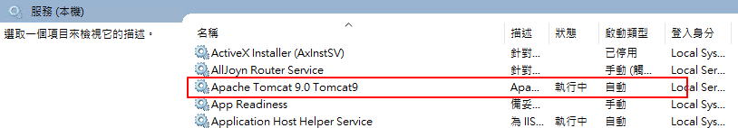

# 透過 Gradlew 直接執行

## 1. 安裝和執行步驟


### Step.1 建立根目錄 (限 Windows)

* 由於多個設定有關路徑的設定會使用到 `/etc/cas` (以 Linux 目錄為主)
    * 可以手動修改目錄
* 如果不想手動修改目錄，一勞永逸的方式就是在專案所在的磁碟根目錄下新增 `etc/cas`
    * 例如：`C://etc/cas` 或 `D://etc/cas`


### Step.2 建立 Keystore

* 執行以下指令產生 keystore
* **Windows**

```shell
gradlew.bat createKeystore
```

* **Linux**

```shell
gradlew createKeystore
```

* keystore 會自動產生到上一個步驟的目錄下
    * 例如：`C://etc/cas` 或 `D://etc/cas`


### Step.3 執行 CAS Server

* 執行以下指令啟動 CAS Server
* **Windows**

```shell
gradlew.bat run
```

* **Linux**

```shell
gradlew run
```

* 執行成功後開啟瀏覽器連到 https://localhost:8443/cas
    * 可以看到 CAS 的登入頁面
        * 預設登入帳號
            * 帳號：`casuser`
            * 密碼：`Mellon`


---

# 2. 設定反向代理

### IIS (Windows)

#### (1) 下載並安裝 Application Request Routing(ARR)

* **[Application Request Routing(ARR)](https://www.microsoft.com/en-us/download/details.aspx?id=47333)**

#### (2) 啟用 IIS 反向代理設定

#### (3) 建立 IIS 應用程式集區

#### (4) 建立 Web 應用程式

TODO...

#### (5) 設定 URL Rewrite (反向代理)

TODO...


---

### Nginx

#### (1) 下載並安裝 Nginx

* [Installing NGINX Open Source](https://docs.nginx.com/nginx/admin-guide/installing-nginx/installing-nginx-open-source/)

TODO...


---

## 3. 設定開機自動啟動

### Windows 

1. 尋找「服務」並開啟
2. 將 Apache Tomcat 的啟動類型改為自動
    * 補充：Apache Tomcat 的啟動和重啟可以在這裡操作

 


### Linux (Ubuntu)

TODO...