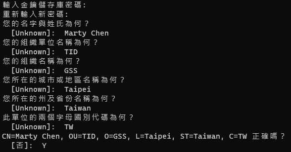

# 佈署到 Tomcat

## 1. 佈署步驟

### Step.1 下載與安裝 Tomcat

#### ● Windows

1. 到 **[Apache Tomcat 官網](https://tomcat.apache.org)** 下載
    * 這裡使用的是 Apache Tomcat 9.0
2. 直接解壓縮

#### ● Linux (Ubuntu)

TODO...


#### ● Tomcat 目錄說明

> 只列會使用到的目錄和檔案

```
├── bin
│    ├── startup.bat
│    └── startup.sh
├── conf
│    ├── server.xml
│    └── tomcat-users.xml
└─── webapps
```

* **bin** － 執行檔
    * 啟動 Server 執行目錄下的 `startup.bat` (Windows) 或 `startup.sh` (Linux)
* **conf** － 設定檔
    * **server.xml** － Server 設定
    * **tomcat-users.xml**  － Tomcat 登入管理帳號設定
* **webapps** － Web 應用程式目錄


---

### Step.2 將 WAR 檔案佈署到 Tomact

* 佈署方式有兩種
    1. 將 WAR 檔案放到 Tomcat 的 `webapps` 目錄下，Tomact 啟動時會自動解壓縮、並載入 WebApp
    2. 透過 Tomcat 管理頁面 (需登入) 將 WAR 檔案佈署上去


---

## 2. 設定 Tomcat 管理帳號 (Optional)

> * **如果不使用 Tomcat 管理頁面佈署 WAR 檔和管理服務可以不用設定**

* 修改 `conf/tomcat-users.xml`

```xml
<tomcat-users>
    <user username="admin" password="<Your Password>" roles="manager-gui"/>
    <user username="robot" password="<Your Password>" roles="manager-script"/>
    
    <role rolename="tomcat"/>
    <role rolename="role1"/>
    <user username="tomcat" password="<Your Password>" roles="tomcat"/>
    <user username="both" password="<Your Password>" roles="tomcat,role1"/>
    <user username="role1" password="<Your Password>" roles="role1"/>
</tomcat-users>
```


---

## 3. 建立/設定 Keystore (Optional)

> * 由於需要處理使用者帳密驗證，因此建議使用 HTTPS，避免帳號與密碼在傳輸時被攔截
> * **如果還需要[透過 IIS 或 Nginx 反向代理](#4. 設定反向代理) 且 CAS Server 與 IIS 或 Nginx 在同一台機器時可以不用設定**
>     * 直接將憑證設定在 IIS 或 Nginx

### Step.1 產生自簽 Keystore

* 執行以下指令

```shell
keytool -genkey -alias "<Your WebApp Name>" -keyalg RSA -keystore server.keystore
```

* 輸入 keystore  密碼，並且填寫一些問題

 

* 最後會產生一個 keystore 檔案


### Step.2 設定 Keystore

* 修改 `conf/server.xml`
    * **keystoreFile** 設定一個 keystore 檔案
    * **KeystorePass** 設定 keystore 的密碼

```xml
<Server>
    <Service>
        <!-- 預設的設定 -->
        <Connector
            executor="tomcatThreadPool"
            port="8080" protocol="HTTP/1.1"
            connectionTimeout="20000"
            redirectPort="8443"
            maxParameterCount="1000"/>
        
        <!-- HTTPS 設定 -->
        <Connector 
            port="8443" 
            protocol="HTTP/1.1"
            acceptCount="100" 
            maxThreads="150"
            maxSpareThreads="1"
            scheme="https"
            keystoreFile="<Your Path>\server.keystore"
            KeystorePass="<Your Password>"
            clientAuth="false"
            sslProtocol="TLS" 
            sslEnabledProtocols="TLSv1,TLSv1.1,TLSv1.2"
            SSLEnabled="true"/>
    </Service>
</Server>
```


### Step.3 確認是否設定成功

* Tomcat 啟動後，開啟瀏覽器輸入 `https://localhost:8443` 確認是否設定成功


---

## 4. 設定反向代理

### IIS

TODO...

### Nginx

TODO...


---

## 5. 設定開機自動啟動

### Windows 

TODO...

### Linux (Ubuntu)

TODO...